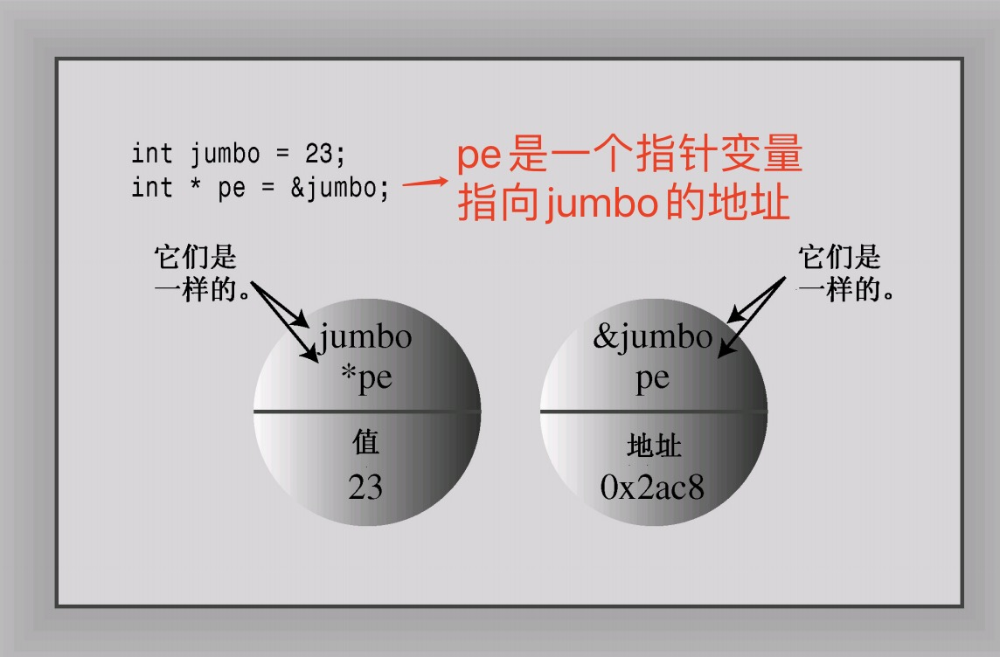

# 字符串输入get读取
为什么要使用get()，而不是getline()呢？
首先，老式实现没有getline()。其次，get()使输入更仔细。
例如，假设用get()将一行读入数组中。
如何知道停止读取的原因是由于已经读取了整行，而不是由于数组已填满呢？
查看下一个输入字符，如果是换行符，说明已读取了整行；否则，说明该行中还有其他输入。
总之，getline()使用起来简单一些，但get()使得检查错误更简单些。可以用其中的任何一个来读取一行输入；
只是应该知道，它们的行为稍有不同。
getline使用
```c++
#include <iostream>
using namespace std;

int main() {
    const int ArSize = 20;  // 声明常量
    char name[ArSize];      // 名字保存在字符串字面量中
    char desSert[ArSize];
    cout << "enter your name:\n";

    // getline()函数每次读取一行。它通过换行符来确定行尾
    cin.getline(name, ArSize);  // 将输入的内容读取到一行中
    cout << "enter your favorite dessert:\n";
    cin.getline(desSert, ArSize);
    cout << "i have some delicious " << desSert;
    cout << " for you, " << name << " .\n";

    // cin.get()有另一种变体。使用不带任何参数的cin.get()调用
    // 可读取下一个字符（即使是换行符），因此可以用它来处理换行符，为
    // 读取下一行输入做好准备
    char name2[ArSize];
    cout << "enter other name:\n";
    cin.get(name2, ArSize);
    cout << "other name: " << name2 << endl;

    return 0;
}

/*
% g11 instr.cpp
% ./a.out
enter your name:
daheige
enter your favorite dessert:
golang c++
i have some delicious golang c++ for you, daheige .
enter other name:
heige
other name: heige
*/

```

get使用
```c++
#include <iostream>
using namespace std;

int main() {
    const int ArSize = 20;  // 声明常量
    char name[ArSize];      // 名字保存在字符串字面量中
    char desSert[ArSize];
    cout << "enter your name:\n";
    // cin.get()有另一种变体。使用不带任何参数的cin.get()调用
    // 可读取下一个字符（即使是换行符），因此可以用它来处理换行符，为
    // 读取下一行输入做好准备
    cin.get(name, ArSize).get();  // 将输入的内容读取到一行中
    cout << "enter your favorite dessert:\n";
    cin.get(desSert, ArSize).get();
    cout << "i have some delicious " << desSert;
    cout << " for you, " << name << " .\n";

    return 0;
}
/*
% g11 instr2.cpp
% ./a.out
enter your name:
daheige
enter your favorite dessert:
golang
i have some delicious golang for you, daheige .
*/
```
- 当getline()或get()读取空行时，将发生什么情况？最初的做法是，下一条输入语句将在前一条getline()或get()结束读取的位置开始读取；但当前的做法是，当get()（不是getline()）读取空行后将设置失效位（failbit）。这意味着接下来的输入将被阻断，但可以用下面的命令来恢复输入：
    ```c++
    cin.clear()
    ```
- 如果输入行包含的字符数比指定的多，则getline()和get()将把余下的字符留在输入队列中，而getline()还会设置失效位，并关闭后面的输入。

# c++中的string
c++ string定义
ISO/ANSI C++98标准通过添加string类扩展了C++库，因此现在可
以string类型的变量（使用C++ 的话说是对象）而不是字符数组来存储字符串。
您将看到，string类使用起来比数组简单，同时提供了将字符串作为一种数据类型的表示方法。
- 要使用string类，必须在程序中包含头文件string。
- string类位于名称空间std中，因此您必须提供一条using编译指令，或者使用std::string来引用它。
```c++
#include <iostream>
#include <string>

int main(){
    string s = "abc";  // 直接定义string
    cout << "s is : " << s << endl;
}
```
string对象和字符数组之间的主要区别是，可以将string对象声明为简单变量，而不是数组。
采用string定义，来简化instr2.cpp 代码，instr3.cpp 代码如下：
```c++
#include <iostream>
#include <string>
using namespace std;

int main() {
    string name;
    string desSert;

    cout << "enter your name:\n";
    cin >> name;  // 将输入的内容读取到name

    cout << "enter your favorite dessert:\n";
    cin >> desSert;

    cout << "i have some delicious " << desSert;
    cout << " for you, " << name << ".\n";

    return 0;
}

/*
% g11 instr3.cpp
% ./a.out
enter your name:
daheige
enter your favorite dessert:
golang
i have some delicious golang for you, daheige.
*/
```

# raw原始字符串显示
```c++
// raw原始字符串输出，使用R开头
// 使用R"+*(标识原始字符串的开头时，必须使用)+*"标识原始字符串的结尾
cout << R"(abc \nhello)" << endl;
```

# 指针变量
```c++
#include <iostream>
using namespace std;

// 指针
// 指针是一个变量，其存储的是值的地址，而不是值本身
// 获取变量的地址，只需要对变量应用地址运算符&，就可以获取变量的位置

int main() {
    int donuts = 6;
    double cpus = 4.5;
    cout << "donuts value = " << donuts << endl;
    cout << "donuts address = " << &donuts << endl;
    cout << "cpus value = " << cpus << endl;
    // 取地址 cpus address = 0x7ff7b3be1fe0
    // 显示地址时，该实现的cout使用十六进制表示法，因为这是常用于描述内存的表示法
    cout << "cpus address = " << &cpus << endl;

    int *p, *q;  // 声明指针变量 int类型的指针变量，变量p,q是一个指针变量
    p = new int;  // new创建指定类型的一个新动态变量，返回指向新变量的指针，就是指向int类型变量的指针
    *p = 12;      // *解引用

    int d;
    // 将d变量的地址赋值给p,p->&d，此时p和d变量的地址指向一个位置
    // 通过&获取变量d的地址
    p = &d;
    // 当解引用实际上获得了d的值，这个时候改变为123，实际上d的值就变化为123
    *p = 123;

    cout << "d = " << d << endl;
    cout << "p = " << p << endl;
    cout << "*p = " << *p << endl;
    int m = 10;
    q = &m;   // 将变量m的地址赋值给指针变量q
    *q = 20;  // 解引用，实际上给m赋值为20

    cout << "q = " << q << endl;  // q是一个指针类型，值是一个指针
    cout << "m = " << m << endl;

    return 0;
}

/*% g11 point.cpp
% ./a.out
donuts value = 6
donuts address = 0x7ff7b510efe8
cpus value = 4.5
cpus address = 0x7ff7b510efe0
d = 123
p = 0x7ff7b510efcc
*p = 123
q = 0x7ff7b510efc8
m = 20
*/

```

- 指针在声明必须指定指针指向的数据的类型
- 在C++中，int* 是一种复合类型，是指向int的指针，可以用同样的句法来声明指向其他类型的指针
```c++
int jumbo = 23;
// 下面的 *pe 类型是int,由于*运算符被用于指针，解引用，因此pe变量本身必须是指针
// pe是指向jumbo变量的内存地址，pe是指针类型
// 这里需要强调一点：int*是一种类型，指向int的指针
// int*,int *在哪里添加空格对于编译器来说没有任何区别
// 在c++中，建议使用int* pe，这样的方式，int* 是一个int类型的指针
// 对每个指针变量名，都需要使用一个*
// 下面的语句将pe（而不是*pe）的值设置为&jumbo 
int* pe = &jumbo;
cout << "jumbo = " << jumbo << endl;
cout << "pe = " << pe << endl;
```


输出结果：
```
jumbo = 23
pe = 0x7ff7bc702fc4
```
# 关于指针使用说明
一定要在对指针应用解除引用运算符（*）之前，将指针初始化为一个确定的、适当的地址。这是关于使用指针的金科玉律。

# new和delete
```c++
// 如何使用指针来管理运行阶段的内存空间分配
// 使用new来分配内存
// 告诉程序需要多少存储int的内存，也就是说根据类型来确定多少字节的内存
// p是被声明为指向int的指针，*p是存储在x那里的值
// 为一个数据对象获取并指定分配内存的格式：typename * pointer_name = new typename
int* p = new int;  // 分配内存是程序运行时进行的，new分配的内存在堆heap上
int x = 12;
p = &x;
*p = 13;  // 解引用赋值，这里会将x的值改成13

// 使用delete释放内存
// 在需要内存的时候，通过new来分配，在不需要内存后，将其归还使用delete处理
// 使用delete时候，后面要加上指向内存块的指针（new分配的内存地址）
// 只能用delete来释放使用new分配的内存。然而，对空指针使用delete是安全的。
int* ps = new int;
delete ps;
```

使用new和delete时，应遵守以下规则:
- 不要使用delete来释放不是new分配的内存。
- 不要使用delete释放同一个内存块两次。
- 如果使用new []为数组分配内存，则应使用delete []来释放。
- 如果使用new []为一个实体分配内存，则应使用delete（没有方括号）来释放。
- 对空指针应用delete是安全的。

为数组分配内存的通用格式：
typename * pointer_name = new typename[num_size]

即使是最好的程序员和软件公司，也可能导致内存泄漏。要避免内存泄漏，最好是养成这样一种习惯，即同时使用new和delete运算符，在自由存储空间上动态分配内存，随后便释放它。
