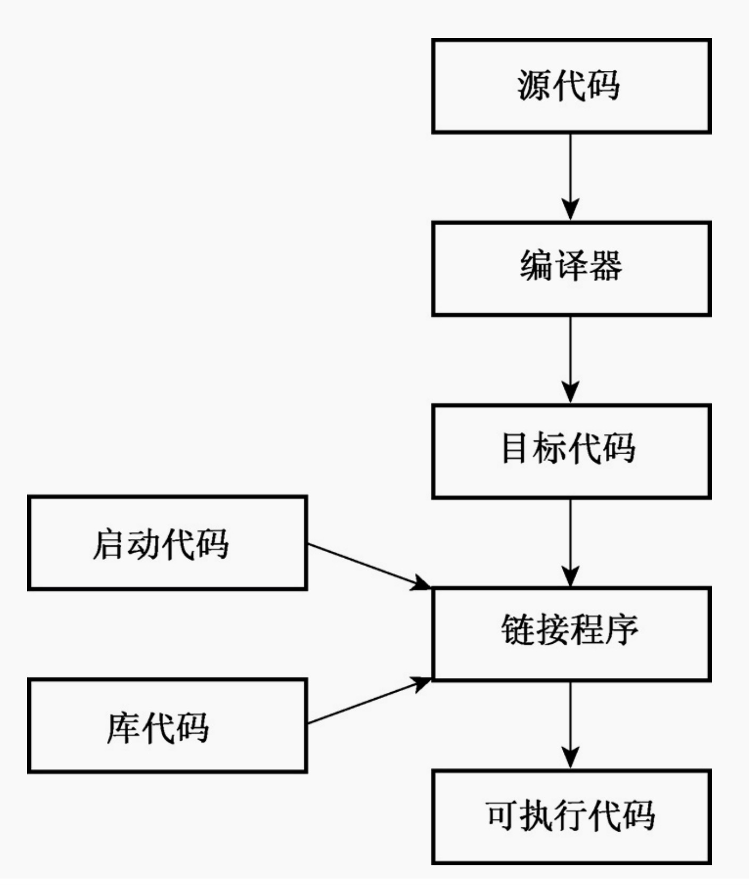

# cpp 学习笔记
    cpp基础入门到实战
# gcc安装
```shell
# mac os安装gcc
brew install gcc

# centos系统安装gcc
sudo yum update
sudo yum install gcc

# ubuntu系统安装gcc
sudo apt update
sudo apt install build-essential # 必要的软件包，包括GNU C编译器、GNU C ++编译器、GNU make和其他必要的工具
sudo apt install gcc
```

查看gcc版本
```shell
gcc --version
```

# 编译运行c++
别名设置不同版本的c++编译方式 vim ~/.bash_profile
```shell
alias gc11="gcc -lstdc++ -std=c++11"
alias gc17="gcc -lstdc++ -std=c++17"
alias g11="g++ -std=c++11"
alias g17="g++ -std=c++17"
```
通过设置别名后，就非常方便，在构建c++程序为二进制文件时，可选择不同的c++版本来编译，比如说：
```shell
g11 -o hello hello.cpp
```
# c++编译运行步骤分解

预处理阶段：
```shell
g++ -o hello.ii -E hello.cpp
```

汇编文件生成：将预处理文件转化为汇编文件
```shell
g++ -o hello.s -S hello.ii
```

目标文件生成：将上一步的汇编文件形成目标文件
```shell
g++ -o hello.o -c hello.s
```

可执行文件生成： 链接，把函数库导入进来，生成可执行文件
```shell
g++ -o helloworld hello.o
```

执行：
```shell
% ./helloworld
hello,world
a,b,c
1
12
1.23
```

以上所有操作，汇总起来就是一个命令
```shell
g++ -o helloworld hello.cpp
```

# c++学习参考书籍
- C++语言的设计和演化 （`学习c++之前，有必要看下c++是怎么设计出来的，这本书是c++之父写的，完整的剖析了c++发展历程和设计哲学，怎么做权衡和取舍的`）
- C++ Primer plus第6版 （中文版）（作为c++入门书籍，非常经典，新手看这本，就可以把c++语言基础入门了）https://github.com/ShujiaHuang/Cpp-Primer-Plus-6th
- C++高级编程 (第4版) （要想成为一名专业的c++程序员，必须扎实理解c++语言的工作原理，以及c++高级特性）
- C++并发编程实战（第2版）（作为c++并发编程的一本好书，值得一看）
- Essential C++中文版 （侯捷 翻译的那本，告诉你如何写出高质量的c++代码）
- modern-cpp-tutorial-zh-cn 现代 C++ 教程：高速上手 C++11/14/17/20 （告诉你如何写出现代化的c++代码）https://github.com/changkun/modern-cpp-tutorial
- C++标准库 第2版 侯捷 翻译 (不熟悉c++标准库，任何人都称不上是高生产力的c++程序员。---Nicolai M. Josuttis（尼古拉·约祖蒂斯）)

# c++源码风格
- 每条语句占一行。
- 每个函数都有一个开始花括号和一个结束花括号，这两个花括号各占据一行。
- 函数中的语句都相对于花括号进行缩进。
- 与函数名称相关的圆括号周围没有空白。