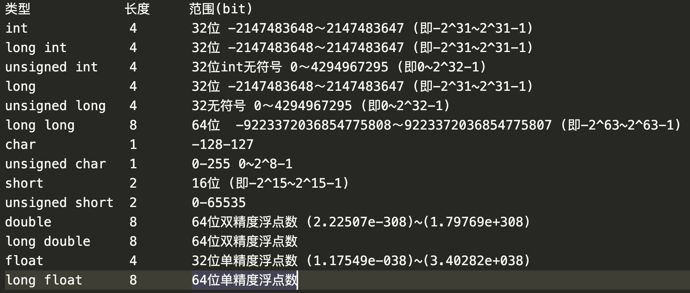
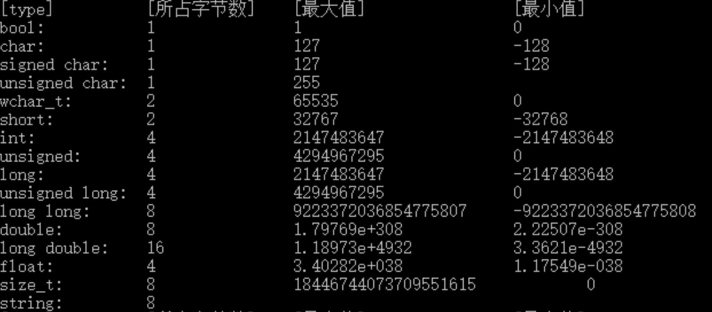

# c++ 数字取值范围




上面所说的全部是有符号型的，short，int，long, long long都默认为有符号型，
其中long和int都占4个字节的空间大小，他们有什么区别呢？
1byte=8bit 不同的操作系统所占据的字节不一样
16位操作系统：long：4字节，int：2字节
32位操作系统：long：4字节，int：4字节
64位操作系统：long：8字节，int：4字节

C语言规定：无论什么平台都要保证long型占用字节数不小于int型, int型不小于short型。
part3/climits.cpp
```cpp
#include <iostream>
#include <climits> // 头文件climits定义了符号常量来表示类型的限制
using namespace std;

int main()
{
    int n_int = INT_MAX;
    short n_short = SHRT_MAX;
    long n_long = LONG_MAX;
    long long n_llong = LLONG_MAX;

    // sizeof检测类型大小
    cout << "int is " << sizeof(int) << " bytes." << endl;
    cout << "short is " << sizeof(n_short) << " bytes." << endl;
    cout << "long is " << sizeof(n_long) << " bytes." << endl;
    cout << "long long is " << sizeof(n_llong) << " bytes." << endl;

    // 最大值
    cout << "maximum values:" << endl;
    cout << "int: " << n_int << endl;
    cout << "short: " << n_short << endl;
    cout << "long: " << n_long << endl;
    cout << "long long: " << n_llong << endl;

    // int类型最小值
    cout << "minimum int value = " << INT_MIN << endl;

    // 位/字节
    cout << "bits per byte = " << CHAR_BIT << endl;

    return 0;
}
```
运行结果：
int is 4 bytes.
short is 2 bytes.
long is 8 bytes.
long long is 8 bytes.
maximum values:
int: 2147483647
short: 32767
long: 9223372036854775807
long long: 9223372036854775807
minimum int value = -2147483648
bits per byte = 8

# sizeof运算符
sizeof运算符指出，在使用8位字节的系统中，int的长度为4个字
节。可对类型名或变量名使用sizeof运算符。对类型名（如int）使用
sizeof运算符时，应将名称放在括号中；但对变量名（如n_short）使用
该运算符，括号是可选的。